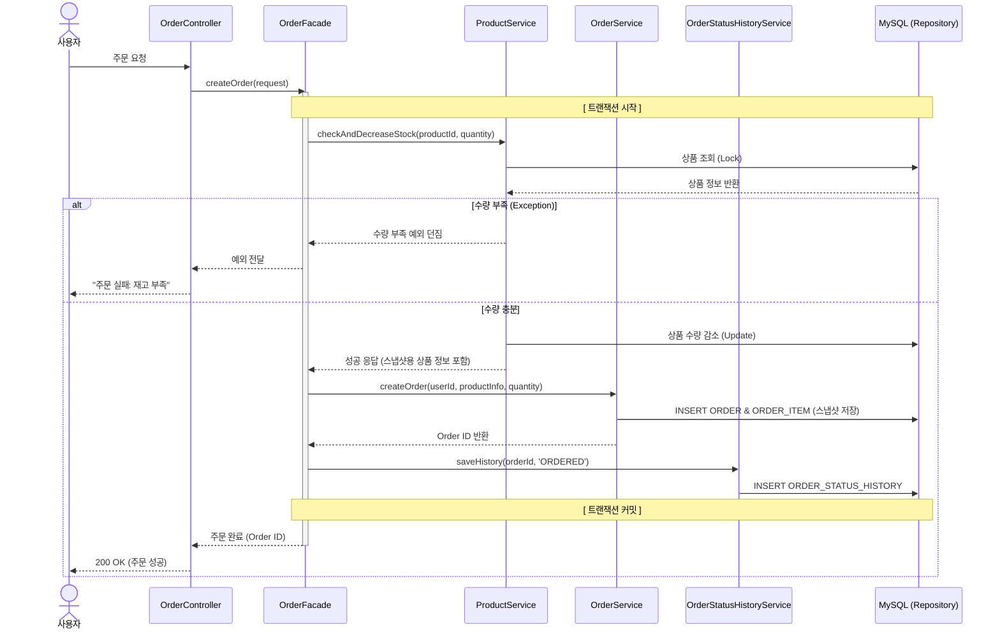

# 주요 시퀀스 다이어그램

### 1. 주문 요청


### 2. 좋아요 클릭
```mermaid
sequenceDiagram
    actor User as 사용자
    participant Ctrl as LikeController
    participant Facade as OrderFacade (Retry)
    participant P_Svc as ProductService
    participant L_Svc as LikeService
    participant DB as MySQL

    User->>Ctrl: 좋아요 클릭
    Ctrl->>Facade: toggleLike(userId, productId)
    
    loop 최대 3회 재시도 (Retry Loop)
        Facade->>Facade: [ 트랜잭션 시작 ]
        
        Facade->>P_Svc: getProduct(productId)
        P_Svc->>DB: SELECT id, like_count, version FROM PRODUCT
        DB-->>P_Svc: 상품 정보 (Version: 1) 반환
        
        Facade->>L_Svc: addLike(userId, productId)
        L_Svc->>DB: INSERT INTO LIKE (Unique Key 체크)
        
        Facade->>P_Svc: increaseLikeCount(productId, version: 1)
        P_Svc->>DB: UPDATE PRODUCT SET like_count=11, version=2 <br/> WHERE id=? AND version=1
        
        alt 업데이트 성공 (Rows Affected = 1)
            DB-->>P_Svc: 성공
            Facade->>Facade: [ 트랜잭션 커밋 ]
            Note over Facade: 루프 종료 (성공)
        else 버전 충돌 (Rows Affected = 0)
            DB-->>P_Svc: 실패 (OptimisticLockException)
            P_Svc-->>Facade: 예외 발생
            Facade->>Facade: [ 트랜잭션 롤백 ]
            Note over Facade: 잠시 대기 후 재시도 결정
        end
    end

    Facade-->>Ctrl: 최종 결과 반환
    Ctrl-->>User: 응답