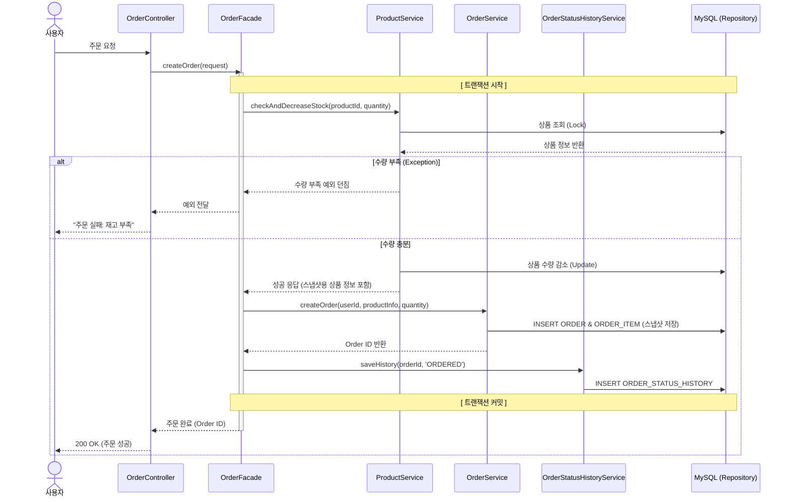
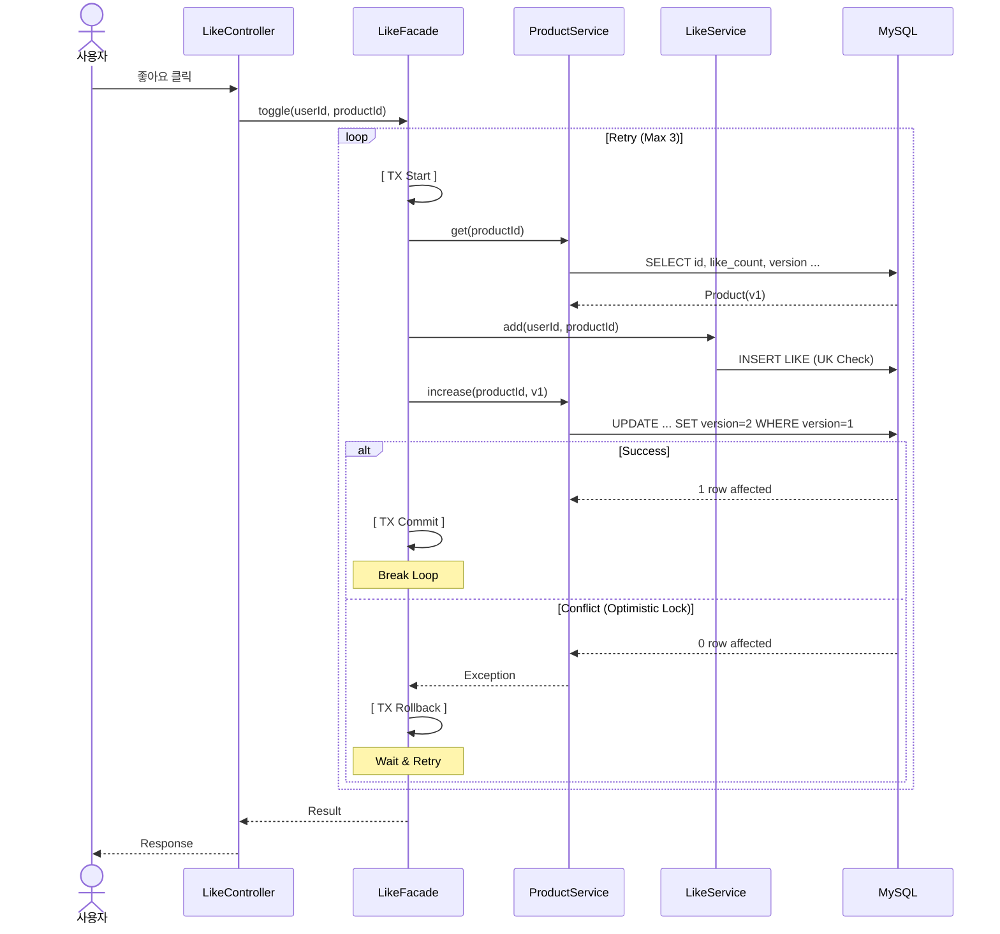
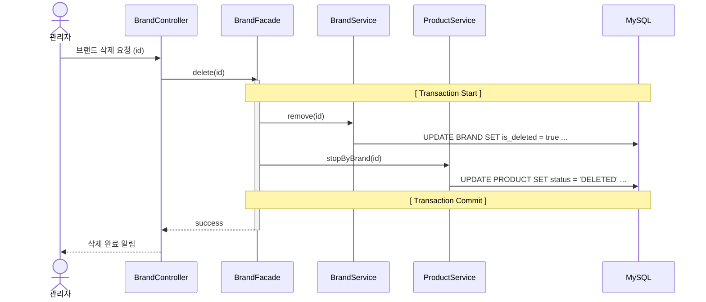

# 주요 시퀀스 다이어그램

### 1. 주문 요청

```mermaid
sequenceDiagram
    actor User as 사용자
    participant Ctrl as OrderController
    participant Facade as OrderFacade
    participant P_Svc as ProductService
    participant O_Svc as OrderService
    participant H_Svc as OrderStatusHistoryService
    participant DB as MySQL (Repository)
    User ->> Ctrl: 주문 요청
    Ctrl ->> Facade: createOrder(request)
    activate Facade
    Note over Facade, DB: [ 트랜잭션 시작 ]
%% 2. 상품 수량 확인 및 감소
    Facade ->> P_Svc: checkAndDecreaseStock(productId, quantity)
    P_Svc ->> DB: 상품 조회 (Lock)
    DB -->> P_Svc: 상품 정보 반환

    alt 수량 부족 (Exception)
        P_Svc -->> Facade: 수량 부족 예외 던짐
        Facade -->> Ctrl: 예외 전달
        Ctrl -->> User: "주문 실패: 재고 부족"
    else 수량 충분
        P_Svc ->> DB: 상품 수량 감소 (Update)
        P_Svc -->> Facade: 성공 응답 (스냅샷용 상품 정보 포함)
    %% 4. ORDER_ITEM 및 주문 생성
        Facade ->> O_Svc: createOrder(userId, productInfo, quantity)
        O_Svc ->> DB: INSERT ORDER & ORDER_ITEM (스냅샷 저장)
        O_Svc -->> Facade: Order ID 반환
    %% 5. 주문 상태 히스토리 저장
        Facade ->> H_Svc: saveHistory(orderId, 'ORDERED')
        H_Svc ->> DB: INSERT ORDER_STATUS_HISTORY
        Note over Facade, DB: [ 트랜잭션 커밋 ]
        Facade -->> Ctrl: 주문 완료 (Order ID)
        deactivate Facade
        Ctrl -->> User: 200 OK (주문 성공)
    end
```

### 2. 좋아요 클릭

```mermaid
sequenceDiagram
    actor User as 사용자
    participant Ctrl as LikeController
    participant Facade as LikeFacade
    participant P_Svc as ProductService
    participant L_Svc as LikeService
    participant DB as MySQL

    User->>Ctrl: 좋아요 클릭
    Ctrl->>Facade: toggle(userId, productId)

    loop Retry (Max 3)
        Facade->>Facade: [ TX Start ]

        Facade->>P_Svc: get(productId)
        P_Svc->>DB: SELECT id, like_count, version ...
        DB-->>P_Svc: Product(v1)

        Facade->>L_Svc: add(userId, productId)
        L_Svc->>DB: INSERT LIKE (UK Check)

        Facade->>P_Svc: increase(productId, v1)
        P_Svc->>DB: UPDATE ... SET version=2 WHERE version=1

        alt Success
            DB-->>P_Svc: 1 row affected
            Facade->>Facade: [ TX Commit ]
            Note over Facade: Break Loop
        else Conflict (Optimistic Lock)
            DB-->>P_Svc: 0 row affected
            P_Svc-->>Facade: Exception
            Facade->>Facade: [ TX Rollback ]
            Note over Facade: Wait & Retry
        end
    end

    Facade-->>Ctrl: Result
    Ctrl-->>User: Response
```

### 3. 브랜드 삭제시 상품 일괄 삭제 시퀀스 다이어그램

```mermaid
sequenceDiagram
    actor Admin as 관리자
    participant Ctrl as BrandController
    participant Facade as BrandFacade
    participant B_Svc as BrandService
    participant P_Svc as ProductService
    participant DB as MySQL

    Admin ->> Ctrl: 브랜드 삭제 요청 (id)
    Ctrl ->> Facade: delete(id)
    activate Facade
    Note over Facade, DB: [ Transaction Start ]

    Facade ->> B_Svc: remove(id)
    B_Svc ->> DB: UPDATE BRAND SET is_deleted = true ...

    Facade ->> P_Svc: stopByBrand(id)
    P_Svc ->> DB: UPDATE PRODUCT SET status = 'DELETED' ...

    Note over Facade, DB: [ Transaction Commit ]
    Facade -->> Ctrl: success
    deactivate Facade
    Ctrl -->> Admin: 삭제 완료 알림
```
