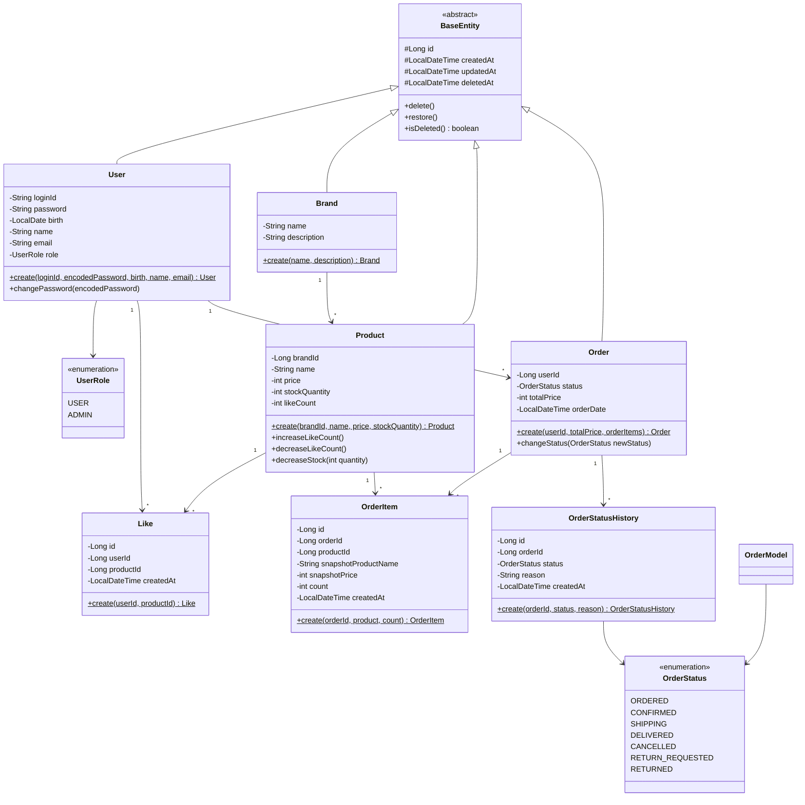

```mermaid
classDiagram
direction TB

      class BaseEntity {
          <<abstract>>
          #Long id
          #LocalDateTime createdAt
          #LocalDateTime updatedAt
          #LocalDateTime deletedAt
          +delete()
          +restore()
          +isDeleted() boolean
      }

      class User {
          -String loginId
          -String password
          -LocalDate birth
          -String name
          -String email
          -UserRole role
          +create(loginId, encodedPassword, birth, name, email)$ User
          +changePassword(encodedPassword)
      }

      class Brand {
          -String name
          -String description
          +create(name, description)$ Brand
      }

      class Product {
          -Long brandId
          -String name
          -int price
          -int stockQuantity
          -int likeCount
          +create(brandId, name, price, stockQuantity)$ Product
          +increaseLikeCount()
          +decreaseLikeCount()
          +decreaseStock(int quantity)
      }

      class Like {
          -Long id
          -Long userId
          -Long productId
          -LocalDateTime createdAt
          +create(userId, productId)$ Like
      }

      class Order {
          -Long userId
          -OrderStatus status
          -int totalPrice
          -LocalDateTime orderDate
          +create(userId, totalPrice, orderItems)$ Order
          +changeStatus(OrderStatus newStatus)
      }

      class OrderItem {
          -Long id
          -Long orderId
          -Long productId
          -String snapshotProductName
          -int snapshotPrice
          -int count
          -LocalDateTime createdAt
          +create(orderId, product, count)$ OrderItem
      }

      class OrderStatusHistory {
          -Long id
          -Long orderId
          -OrderStatus status
          -String reason
          -LocalDateTime createdAt
          +create(orderId, status, reason)$ OrderStatusHistory
      }

      class UserRole {
          <<enumeration>>
          USER
          ADMIN
      }

      class OrderStatus {
          <<enumeration>>
          ORDERED
          CONFIRMED
          SHIPPING
          DELIVERED
          CANCELLED
          RETURN_REQUESTED
          RETURNED
      }

      BaseEntity <|-- User
      BaseEntity <|-- Brand
      BaseEntity <|-- Product
      BaseEntity <|-- Order

      User --> UserRole

      Brand "1" --> "*" Product
      User "1" --> "*" Like
      Product "1" --> "*" Like
      User "1" --> "*" Order
      Order "1" --> "*" OrderItem
      Order "1" --> "*" OrderStatusHistory
      Product "1" --> "*" OrderItem
      OrderModel --> OrderStatus
      OrderStatusHistory --> OrderStatus
```