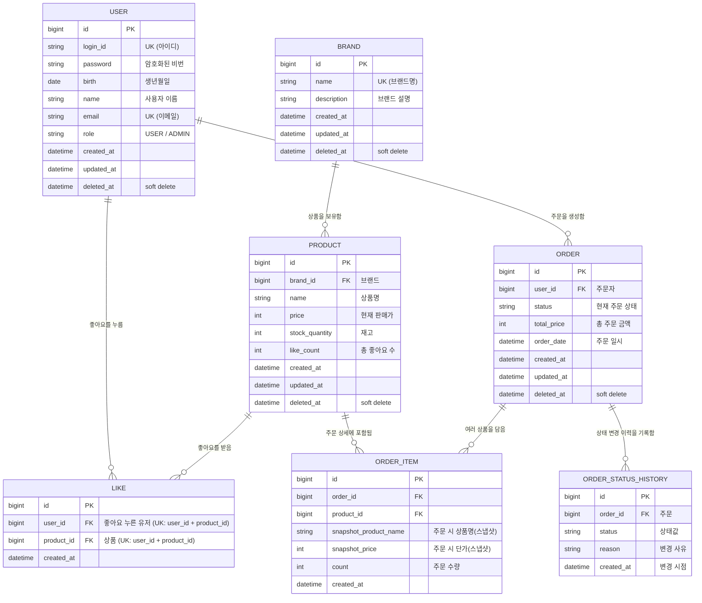

```mermaid
erDiagram
    USER ||--o{ LIKE : "좋아요를 누름"
    USER ||--o{ ORDER : "주문을 생성함"
    BRAND ||--o{ PRODUCT : "상품을 보유함"

    PRODUCT ||--o{ LIKE : "좋아요를 받음"
    PRODUCT ||--o{ ORDER_ITEM : "주문 상세에 포함됨"

    ORDER ||--o{ ORDER_ITEM : "여러 상품을 담음"
    ORDER ||--o{ ORDER_STATUS_HISTORY : "상태 변경 이력을 기록함"

    USER {
        bigint id PK
        string login_id "UK (아이디)"
        string password "암호화된 비번"
        date birth "생년월일"
        string name "사용자 이름"
        string email "UK (이메일)"
        string role "USER / ADMIN"
        datetime created_at
        datetime updated_at
        datetime deleted_at "soft delete"
    }

    BRAND {
        bigint id PK
        string name "UK (브랜드명)"
        string description "브랜드 설명"
        datetime created_at
        datetime updated_at
        datetime deleted_at "soft delete"
    }

    PRODUCT {
        bigint id PK
        bigint brand_id FK "브랜드"
        string name "상품명"
        int price "현재 판매가"
        int stock_quantity "재고"
        int like_count "총 좋아요 수"
        datetime created_at
        datetime updated_at
        datetime deleted_at "soft delete"
    }

    LIKE {
        bigint id PK
        bigint user_id FK "좋아요 누른 유저 (UK: user_id + product_id)"
        bigint product_id FK "상품 (UK: user_id + product_id)"
        datetime created_at
    }

    ORDER {
        bigint id PK
        bigint user_id FK "주문자"
        string status "현재 주문 상태"
        int total_price "총 주문 금액"
        datetime order_date "주문 일시"
        datetime created_at
        datetime updated_at
        datetime deleted_at "soft delete"
    }

    ORDER_ITEM {
        bigint id PK
        bigint order_id FK
        bigint product_id FK
        string snapshot_product_name "주문 시 상품명(스냅샷)"
        int snapshot_price "주문 시 단가(스냅샷)"
        int count "주문 수량"
        datetime created_at
    }

    ORDER_STATUS_HISTORY {
        bigint id PK
        bigint order_id FK "주문"
        string status "상태값"
        string reason "변경 사유"
        datetime created_at "변경 시점"
    }
```
